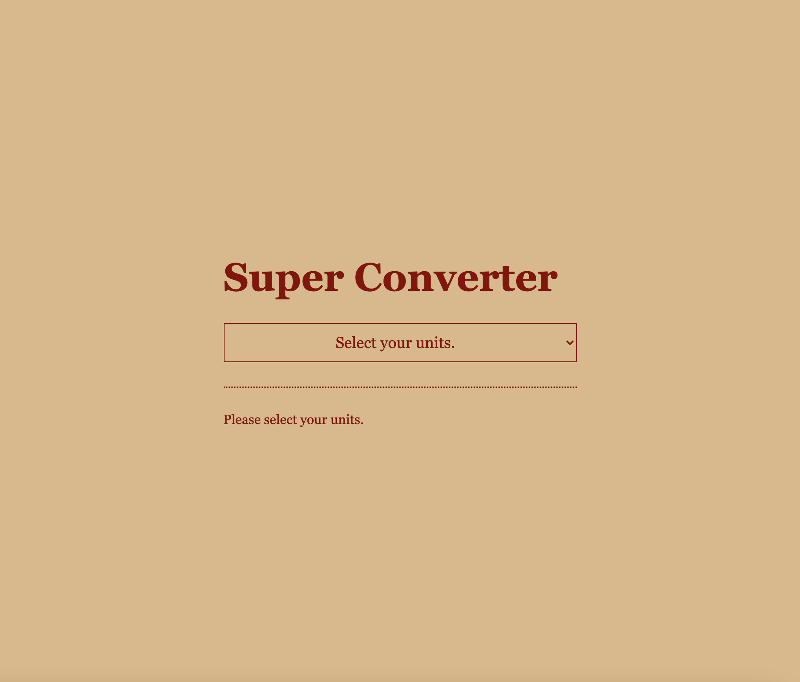
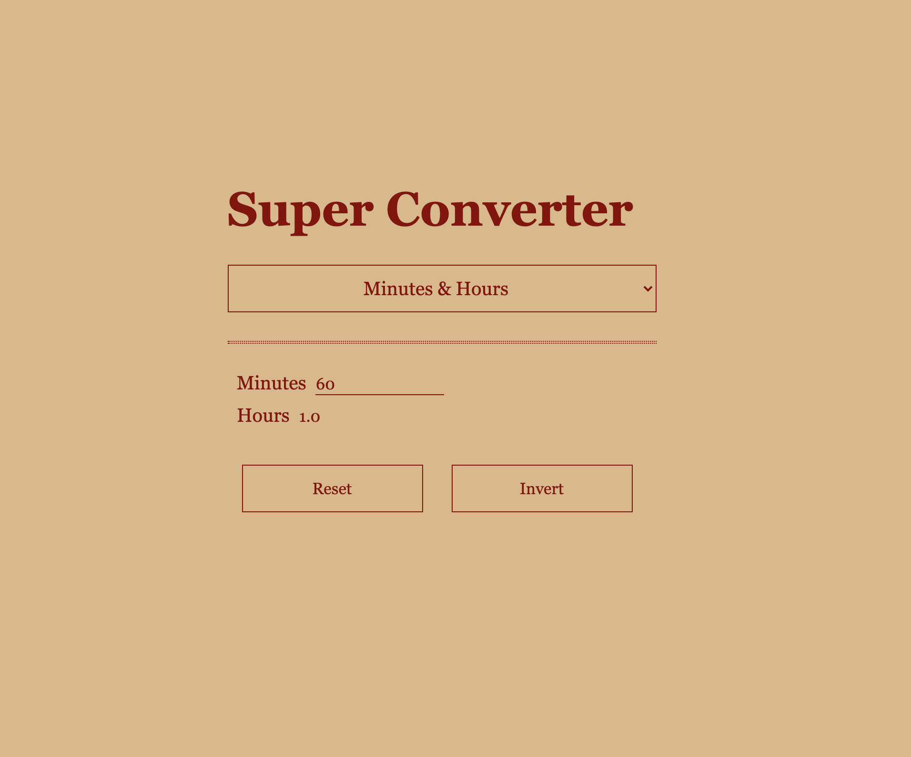
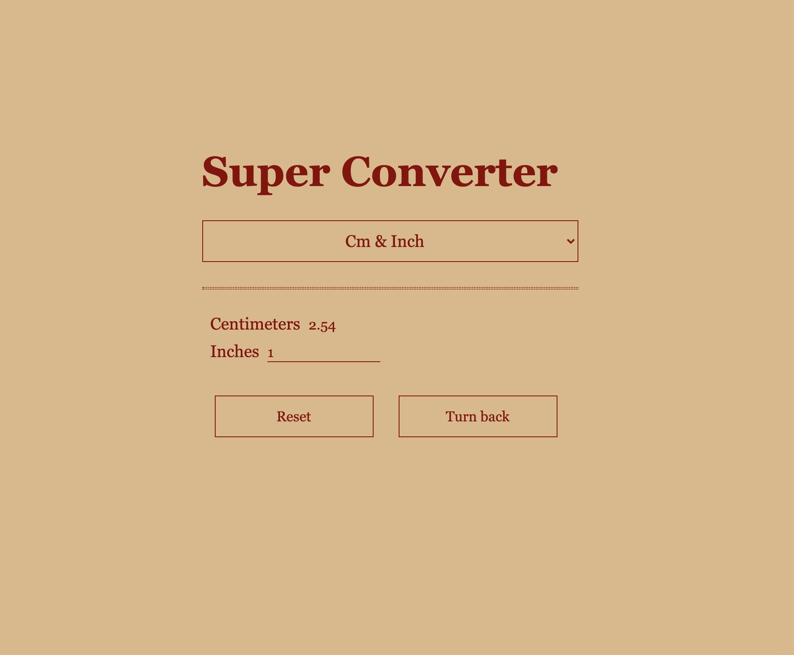

# Make a react super converter

## • Select Minute&Hour or Cm&Inch
</img>

## • Minute to Hour
</img>

## • Centimeter to Inch
</img>

__You can also convert in reverse by clicking the invert button.__
